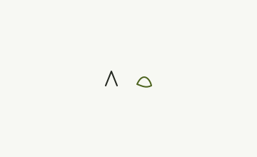

  

  <strong>An open, machine-readable visual intermediate representation for visual intent.</strong>

  A JSON document describes what exists, how it appears, how it behaves, how it moves, 
  and which evidence defines the expected result, independently of tool, framework, or platform.

  
  
  

---

## Abstract

Visual Spec is a **visual intermediate representation (Visual IR)**: a persistent, portable JSON contract for visual intent. Independently of editor, generator, or runtime, a document records:

- what exists visually and retains identity,
- how it should appear and be organized,
- how it should behave and move,
- how it changes over time,
- how it should be perceived and operated,
- and which evidence determines whether a result is correct.

This repository publishes that contract: the **JSON Schema** distribution, **semantic rules**, **profile specializations**, **worked examples**, and the **normative specification** that states what those fields mean. It is not a UI library, renderer, game engine, or replacement for HTML, CSS, Figma, glTF, USD, Flutter, SwiftUI, Compose, Unity, or Unreal.

**Schema id:** [https://visualspec.dev/schema/1.0/schema.json](https://visualspec.dev/schema/1.0/schema.json)  
**Schema files:** [packages/schema/schema/1.0/schema.json](./packages/schema/schema/1.0/schema.json)  
**Document format:** visualSpec 1.0 · **Release:** 1.0.0-rc.1  
**Maintainer:** [Gustavo Franco](https://github.com/gfrancodev)

## Contents

- [Visual Spec in the era of generative models](#visual-spec-in-the-era-of-generative-models)
- [Definition and non-goals](#definition-and-non-goals)
- [Conceptual models](#conceptual-models)
- [Document shape](#document-shape)
- [Schema distribution](#schema-distribution)
- [Profiles](#profiles)
- [Conformance](#conformance)
- [Use cases](#use-cases)
- [Status and governance](#status-and-governance)
- [License](#license)

## Visual Spec in the era of generative models

Generative systems now emit pixels, markup, toolkit code, and motion with increasing fluency. Fluency is not the same as a contract. A screenshot captures one rendered moment. A design file records the choices its editor supports. A source repository contains one implementation. A prompt is an instruction, not a reviewable artifact. None of those, by itself, reliably preserves the intended relationships among appearance, behavior, time, meaning, and evidence across media and toolchains.

The missing handoff is usually filled with interpretation: a developer chooses a breakpoint, a generator guesses an animation, another team rebuilds a component with different keyboard behavior. The result can look close while losing the reason the original was designed that way.

Visual Spec makes that handoff explicit. The document is the artifact between understanding and rendering:

Sources → Understanding / Authoring → Visual Spec → Adapter → Render → Validate

A framework-independent JSON description of an interface is not new. UIDL, IFML, and the W3C model-based UI work already separate an intermediate description from a target toolkit. Design tokens already have a community format. Web Animations, CSS easing, and platform springs already describe timing and physics. Visual Spec 1.0 does not claim to be the first visual IR.

**Its claim is composition:** one document for evidence, tokens, components, scenes, motion, accessibility, and conformance, specialized by media profile, with provenance kept explicit. That composition is what generative pipelines need if they are to be inspected, versioned, validated, and retargeted instead of only sampled.

A model that writes Visual Spec can be checked against JSON Schema and semantic rules before any adapter runs. An adapter can fail honestly on unsupported required capabilities. Structural validity and runtime fidelity remain distinct. Those distinctions collapse when the only artifact is an image or a framework-specific tree.

The machine-checkable surface of that claim is the schema tree under [packages/schema/schema/1.0/](./packages/schema/schema/1.0/).

## Definition and non-goals

Visual Spec documents **visual intent**. Observable visual responses (for example, closing a dialog on activate) belong in the format. Computing loan eligibility, applying damage points, or encoding an HTTP API does not.

A conforming document **must not** represent:

- database schemas, HTTP APIs, authentication, authorization, or billing,
- networking protocols or backend orchestration,
- business rules or gameplay formulas (damage, inventory, economy, win conditions),
- physics simulation as game logic, or application domain decisions.

The format does not include a production adapter. Parsing a field does not implement its rendering behavior.

## Conceptual models

A complete document may combine complementary models. Each answers a different question. None of them encode application business logic. These graphs can refer to the same object without being the same tree.

| Model | Question |
| --- | --- |
| Reference | Which evidence defines the expected result? |
| World | What exists and retains identity? |
| Scene | Where and how does a representation appear? |
| Component | Which reusable interface patterns are composed? |
| Semantic | What meaning and reading relationships are exposed? |
| Relationship | How do independently identified things relate? |
| Event | What occurred (activation, marker, gesture, …)? |
| Action | What visual response is requested? |
| State | Which visual condition is active? |
| Motion | How does appearance change during a transition? |
| Timeline | When do clips, markers, and sync events occur? |
| Accessibility | How must the result be named, focused, and operated? |
| Rendering | Under which targets and capabilities is output produced? |
| Validation | What evidence is needed to judge the result? |

A decorative background may exist in a scene and be absent from the semantic tree. An entity may appear in multiple scenes without becoming a new entity.

JSON Schema defines structural shape. [semantic-rules.json](./packages/schema/schema/1.0/semantic-rules.json) adds identifier, reference, token, time, graph, and state checks that Schema alone cannot express. Normative meaning of those fields is in [specification/1.0](./specification/1.0/).

## Document shape

A Visual Spec 1.0 document is a JSON object. It **must** set `visualSpec` to `"1.0"`, include `metadata`, and include a non-empty `profiles` array. When `$schema` is present, it **must** equal `https://visualspec.dev/schema/1.0/schema.json`. Unknown root properties **must not** be used outside `extensions`.

Consumers **must** pin `visualSpec: "1.0"` and validate against that versioned schema id (or the matching files in this repository). A “latest” discovery URL, if published, is discovery-only and **must not** be the sole dependency of a reproducible build.

Canonical minimal document: [hello.json](./packages/schema/examples/hello.json). It declares `visualSpec: "1.0"`, `metadata`, profile `ui`, and one 2D scene with a text node.

The root schema enumerates optional areas (sources, visual references, tokens, world, entities, components, semantics, events, actions, states, motion, timelines, assets, cameras, lights, materials, accessibility, rendering, validation, extensions). Not every document needs every area. A photograph may omit components. A UI screen may omit cameras. Profile schemas impose additional required properties.

Addressable identifiers **must** match `^[A-Za-z_][A-Za-z0-9_.:/-]*$` and remain unique in the document namespace.

## Schema distribution

The 1.0 machine contract lives in [packages/schema/schema/1.0/](./packages/schema/schema/1.0/). JSON Schema dialect is Draft 2020-12. Those files are generated; they must not be hand-edited. When meaning changes, update [specification/1.0](./specification/1.0/) together with the schema. [SHA256SUMS](./packages/schema/schema/1.0/SHA256SUMS) records the published byte hashes.

| File | Role |
| --- | --- |
| [schema.json](./packages/schema/schema/1.0/schema.json) | Root document schema. Its `$id` is `https://visualspec.dev/schema/1.0/schema.json`. |
| [schema.bundle.json](./packages/schema/schema/1.0/schema.bundle.json) | Single-file bundle for offline validation. |
| [manifest.json](./packages/schema/schema/1.0/manifest.json) | Version, schema URLs, profile list, module list, semantic rule codes. |
| [catalog.json](./packages/schema/schema/1.0/catalog.json) | Module titles, descriptions, and definition names. |
| [semantic-rules.json](./packages/schema/schema/1.0/semantic-rules.json) | Rules beyond JSON Schema (ids, refs, tokens, time, graphs, state). |
| [modules/](./packages/schema/schema/1.0/modules/) | One schema per conceptual area. The root schema refers into these definitions. |
| [profiles/](./packages/schema/schema/1.0/profiles/) | Per-profile required shapes. |

The root schema composes the modules: metadata comes from common, scene trees from scene, and so on.

Modules in 1.0 (see [manifest.json](./packages/schema/schema/1.0/manifest.json)):

common, references, appearance, tokens, layout, geometry, accessibility, components, semantics, interaction, motion, timeline, assets, camera, lighting, materials, effects, world, scene, media, presentation, document, three-d, game, rendering, validation.

Pin implementations to these files (or their `$id` URLs), not to a floating “latest”.

## Profiles

Official 1.0 profiles (must use these names when selected). Each has a schema in [packages/schema/schema/1.0/profiles/](./packages/schema/schema/1.0/profiles/).

ui, image, illustration, document, presentation, video, motion-graphics, 3d, game

Profiles specialize the shared core. A document **may** combine profiles. Shared identifiers, assets, references, and tokens remain one namespace. Profile combination **must not** introduce contradictory requirements for the same aspect without an explicit conflict policy.

| Profile | Schema-enforced minimum |
| --- | --- |
| `ui` | at least one `scenes` entry |
| `image` | `entities`, `scenes`, `cameras` (each min 1) |
| `illustration` | `illustrations`, `entities` (each min 1) |
| `document` | `documents` (min 1) |
| `presentation` | `presentations` (min 1) |
| `video` | `videos`, `timelines` (each min 1) |
| `motion-graphics` | `motion`, `scenes` (each min 1) |
| `3d` | `threeD`, `scenes`, `entities` (`scenes` / `entities` min 1) |
| `game` | `game` |

## Conformance

Three questions **must** remain distinct:

1. **Structural:** Does the JSON satisfy the Draft 2020-12 schemas (types, required fields, enums, bounds)?
2. **Semantic:** Do identifiers resolve, graphs stay acyclic, intervals order correctly, and declared `VS-*` rules hold? Validators **must not** fetch or execute reference targets to decide these checks.
3. **Runtime:** Does a particular implementation produce the required appearance, interaction, semantics, and motion under declared conditions?

Passing one level does not imply the next. This repository publishes the schemas and the semantic rules. It does not certify runtime rendering.

**Document conformance.** A conforming document declares version and profiles, satisfies applicable schemas, uses unique addressable identifiers, resolves required internal references, and obeys normative semantic rules. It **must not** hide required behavior only inside an unrecognized optional extension.

**Implementation conformance.** An implementation declares the format version, profiles, modules, extensions, and operations it supports. Unsupported **required** capabilities are errors. Allowed approximations **must** be reported.

## Use cases

The documents in [packages/schema/examples/](./packages/schema/examples/) are the same contracts used on the published pages: a validated Visual Spec file as input, a generated artifact as output. They are not copies. Interactive, video, 3D, and document results are on [visualspec.dev/use-cases](https://visualspec.dev/use-cases/). The catalog is [index.json](./packages/schema/examples/index.json).

The only still image in that set is the illustration study. It is shown here. The SVG is the generated artifact already in the repository, not a second spec.

### Mark study (illustration)

A shared contract for shape language: orchard mark, leaf symbol, tokens, and an inspiration reference. Typical uses: editorial illustration, icon families, brand illustration systems.

  

Document: [illustration.json](./packages/schema/examples/illustration.json) · [Use case on the site](https://visualspec.dev/use-cases/illustration/)

| Title | Profiles | Spec | Site |
| --- | --- | --- | --- |
| Hello Visual Spec | ui | [hello.json](./packages/schema/examples/hello.json) | [use-cases/hello](https://visualspec.dev/use-cases/hello/) |
| Checkout card | ui | [ui.json](./packages/schema/examples/ui.json) | [use-cases/ui](https://visualspec.dev/use-cases/ui/) |
| Ceramic cup still | image | [image.json](./packages/schema/examples/image.json) | [use-cases/image](https://visualspec.dev/use-cases/image/) |
| Field notes | document | [document.json](./packages/schema/examples/document.json) | [use-cases/document](https://visualspec.dev/use-cases/document/) |
| Intent deck | presentation | [presentation.json](./packages/schema/examples/presentation.json) | [use-cases/presentation](https://visualspec.dev/use-cases/presentation/) |
| Four second still | video | [video.json](./packages/schema/examples/video.json) | [use-cases/video](https://visualspec.dev/use-cases/video/) |
| Title fade | motion-graphics | [motion-graphics.json](./packages/schema/examples/motion-graphics.json) | [use-cases/motion-graphics](https://visualspec.dev/use-cases/motion-graphics/) |
| Cup study | 3d | [3d.json](./packages/schema/examples/3d.json) | [use-cases/3d](https://visualspec.dev/use-cases/3d/) |
| Grove HUD | game | [game.json](./packages/schema/examples/game.json) | [use-cases/game](https://visualspec.dev/use-cases/game/) |
| Product configurator | ui, 3d | [ui-3d.json](./packages/schema/examples/ui-3d.json) | [use-cases/ui-3d](https://visualspec.dev/use-cases/ui-3d/) |
| Narrated deck | presentation, video | [presentation-video.json](./packages/schema/examples/presentation-video.json) | [use-cases/presentation-video](https://visualspec.dev/use-cases/presentation-video/) |

Normative prose for the same version is [specification/1.0](./specification/1.0/). Governance: [GOVERNANCE.md](./GOVERNANCE.md), [CONTRIBUTING.md](./CONTRIBUTING.md), [RFC process](./rfcs/0000-process.md).

## Status and governance

Visual Spec is **maintainer-led**. There is no independent standards committee. Gustavo Franco decides releases, RFC acceptance, and repository direction.

The 1.0 specification and the files under [packages/schema/schema/1.0/](./packages/schema/schema/1.0/) define normative behavior for document format visualSpec 1.0. The tagged release is 1.0.0-rc.1. The format has **not** been independently ratified as a final standard.

- Distinguish **document format version**, **implementation version** (validator / renderer), and **asset / reference version**.
- Editorial clarifications **may** improve prose without changing previously valid behavior.
- Normative changes, new profiles, and compatibility breaks require the [RFC process](./rfcs/0000-process.md).

Public specification text is written in **English**.

## License

Copyright 2026 Gustavo Franco.

Licensed under the [Apache License, Version 2.0](./LICENSE). You may not use this project except in compliance with the License.
